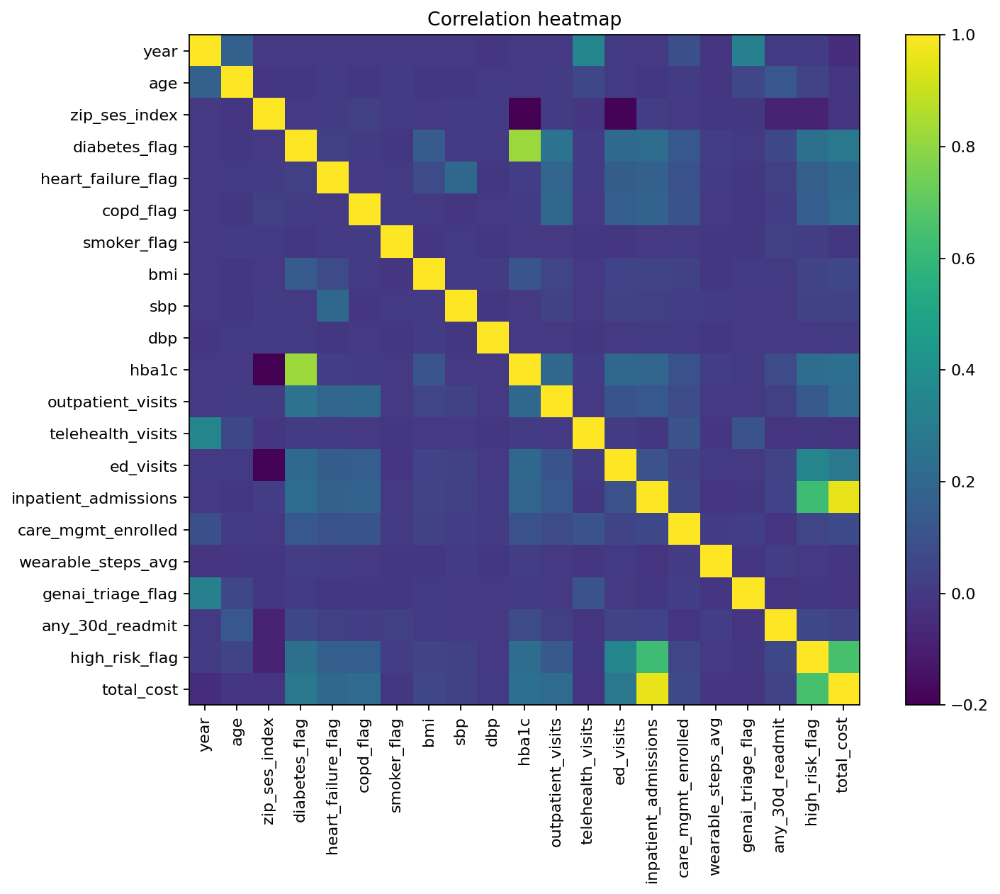

# Correlation matrix

|                      |   patient_id |   year |    age |   zip_ses_index |   diabetes_flag |   heart_failure_flag |   copd_flag |   smoker_flag |    bmi |    sbp |    dbp |   hba1c |   outpatient_visits |   telehealth_visits |   ed_visits |   inpatient_admissions |   care_mgmt_enrolled |   wearable_steps_avg |   genai_triage_flag |   any_30d_readmit |   high_risk_flag |   total_cost |
|:---------------------|-------------:|-------:|-------:|----------------:|----------------:|---------------------:|------------:|--------------:|-------:|-------:|-------:|--------:|--------------------:|--------------------:|------------:|-----------------------:|---------------------:|---------------------:|--------------------:|------------------:|-----------------:|-------------:|
| patient_id           |        1     | -0     | -0.005 |          -0.005 |          -0.016 |               -0.016 |      -0.025 |        -0.028 | -0.011 | -0.002 | -0.008 |  -0.022 |              -0.002 |              -0.007 |      -0.007 |                 -0.013 |               -0.015 |                0.007 |               0.003 |            -0.004 |           -0.014 |       -0.015 |
| year                 |       -0     |  1     |  0.167 |           0     |           0     |                0     |       0     |         0     | -0.003 | -0.003 | -0.01  |  -0.002 |              -0.001 |               0.347 |       0.004 |                 -0.001 |                0.094 |               -0.015 |               0.323 |             0.005 |            0.011 |       -0.043 |
| age                  |       -0.005 |  0.167 |  1     |          -0.01  |          -0.006 |                0.005 |      -0.003 |         0.007 | -0.004 | -0.004 |  0.004 |  -0     |               0.01  |               0.061 |       0.005 |                 -0.007 |                0.007 |               -0.011 |               0.055 |             0.124 |            0.047 |       -0.012 |
| zip_ses_index        |       -0.005 |  0     | -0.01  |           1     |          -0.001 |                0.01  |       0.028 |         0.002 | -0.001 |  0.009 |  0.008 |  -0.2   |               0.01  |              -0.009 |      -0.189 |                  0.017 |               -0     |               -0.004 |              -0.004 |            -0.084 |           -0.085 |       -0.014 |
| diabetes_flag        |       -0.016 |  0     | -0.006 |          -0.001 |           1     |                0.025 |       0.015 |        -0.004 |  0.142 |  0.003 |  0.004 |   0.82  |               0.257 |               0.008 |       0.212 |                  0.225 |                0.132 |                0.017 |               0.003 |             0.059 |            0.245 |        0.28  |
| heart_failure_flag   |       -0.016 |  0     |  0.005 |           0.01  |           0.025 |                1     |      -0.003 |         0.002 |  0.072 |  0.205 | -0.005 |   0.018 |               0.192 |               0.01  |       0.152 |                  0.166 |                0.101 |                0.013 |              -0.006 |             0.025 |            0.162 |        0.204 |
| copd_flag            |       -0.025 |  0     | -0.003 |           0.028 |           0.015 |               -0.003 |       1     |         0.012 |  0.002 | -0.012 |  0     |   0.007 |               0.2   |              -0.001 |       0.158 |                  0.177 |                0.113 |               -0.002 |              -0.004 |             0.019 |            0.161 |        0.221 |
| smoker_flag          |       -0.028 |  0     |  0.007 |           0.002 |          -0.004 |                0.002 |       0.012 |         1     | -0.008 |  0.005 | -0.005 |  -0.002 |               0.001 |              -0.004 |      -0.009 |                 -0.002 |                0.004 |               -0.003 |              -0.006 |             0.029 |            0.018 |       -0.004 |
| bmi                  |       -0.011 | -0.003 | -0.004 |          -0.001 |           0.142 |                0.072 |       0.002 |        -0.008 |  1     |  0.004 |  0.006 |   0.116 |               0.049 |              -0.001 |       0.043 |                  0.046 |                0.034 |               -0.004 |               0.003 |             0.003 |            0.045 |        0.057 |
| sbp                  |       -0.002 | -0.003 | -0.004 |           0.009 |           0.003 |                0.205 |      -0.012 |         0.005 |  0.004 |  1     | -0.004 |   0.001 |               0.035 |               0.002 |       0.037 |                  0.028 |                0.018 |                0.008 |              -0.001 |            -0     |            0.034 |        0.036 |
| dbp                  |       -0.008 | -0.01  |  0.004 |           0.008 |           0.004 |               -0.005 |       0     |        -0.005 |  0.006 | -0.004 |  1     |   0.001 |              -0.003 |              -0.007 |      -0.002 |                  0.006 |                0.003 |               -0.004 |              -0.003 |            -0     |            0.001 |        0.006 |
| hba1c                |       -0.022 | -0.002 | -0     |          -0.2   |           0.82  |                0.018 |       0.007 |        -0.002 |  0.116 |  0.001 |  0.001 |   1     |               0.208 |               0.011 |       0.205 |                  0.189 |                0.101 |                0.016 |               0.003 |             0.076 |            0.229 |        0.239 |
| outpatient_visits    |       -0.002 | -0.001 |  0.01  |           0.01  |           0.257 |                0.192 |       0.2   |         0.001 |  0.049 |  0.035 | -0.003 |   0.208 |               1     |              -0.001 |       0.114 |                  0.13  |                0.077 |               -0.001 |              -0.003 |             0.028 |            0.133 |        0.219 |
| telehealth_visits    |       -0.007 |  0.347 |  0.061 |          -0.009 |           0.008 |                0.01  |      -0.001 |        -0.004 | -0.001 |  0.002 | -0.007 |   0.011 |              -0.001 |               1     |       0.009 |                 -0.006 |                0.106 |               -0.011 |               0.109 |            -0.02  |           -0.004 |       -0.016 |
| ed_visits            |       -0.007 |  0.004 |  0.005 |          -0.189 |           0.212 |                0.152 |       0.158 |        -0.009 |  0.043 |  0.037 | -0.002 |   0.205 |               0.114 |               0.009 |       1     |                  0.099 |                0.047 |                0.006 |               0.001 |             0.046 |            0.346 |        0.274 |
| inpatient_admissions |       -0.013 | -0.001 | -0.007 |           0.017 |           0.225 |                0.166 |       0.177 |        -0.002 |  0.046 |  0.028 |  0.006 |   0.189 |               0.13  |              -0.006 |       0.099 |                  1     |                0.062 |               -0.013 |              -0.006 |             0.043 |            0.626 |        0.959 |
| care_mgmt_enrolled   |       -0.015 |  0.094 |  0.007 |          -0     |           0.132 |                0.101 |       0.113 |         0.004 |  0.034 |  0.018 |  0.003 |   0.101 |               0.077 |               0.106 |       0.047 |                  0.062 |                1     |                0.007 |               0.024 |            -0.013 |            0.049 |        0.071 |
| wearable_steps_avg   |        0.007 | -0.015 | -0.011 |          -0.004 |           0.017 |                0.013 |      -0.002 |        -0.003 | -0.004 |  0.008 | -0.004 |   0.016 |              -0.001 |              -0.011 |       0.006 |                 -0.013 |                0.007 |                1     |              -0.008 |             0.018 |            0.001 |       -0.01  |
| genai_triage_flag    |        0.003 |  0.323 |  0.055 |          -0.004 |           0.003 |               -0.006 |      -0.004 |        -0.006 |  0.003 | -0.001 | -0.003 |   0.003 |              -0.003 |               0.109 |       0.001 |                 -0.006 |                0.024 |               -0.008 |               1     |            -0.013 |           -0.004 |       -0.018 |
| any_30d_readmit      |       -0.004 |  0.005 |  0.124 |          -0.084 |           0.059 |                0.025 |       0.019 |         0.029 |  0.003 | -0     | -0     |   0.076 |               0.028 |              -0.02  |       0.046 |                  0.043 |               -0.013 |                0.018 |              -0.013 |             1     |            0.06  |        0.048 |
| high_risk_flag       |       -0.014 |  0.011 |  0.047 |          -0.085 |           0.245 |                0.162 |       0.161 |         0.018 |  0.045 |  0.034 |  0.001 |   0.229 |               0.133 |              -0.004 |       0.346 |                  0.626 |                0.049 |                0.001 |              -0.004 |             0.06  |            1     |        0.652 |
| total_cost           |       -0.015 | -0.043 | -0.012 |          -0.014 |           0.28  |                0.204 |       0.221 |        -0.004 |  0.057 |  0.036 |  0.006 |   0.239 |               0.219 |              -0.016 |       0.274 |                  0.959 |                0.071 |               -0.01  |              -0.018 |             0.048 |            0.652 |        1     |

## Interpretation — Correlations

**What you’ll see.**  
Utilization features correlate **positively** with total_cost; **HbA1c** tends to track with readmissions and cost; physical-activity proxy (wearable_steps_avg) has **negative** associations with ED/cost.

**Caveats.**  
Correlations are not causal; shared drivers (frailty, access, polypharmacy) can produce spurious links.

**Actions.**  
Use correlations to **screen features** and set **reasonableness checks** (e.g., rising steps ↔ falling ED). Verify directions in multivariate models or pilots before acting.
