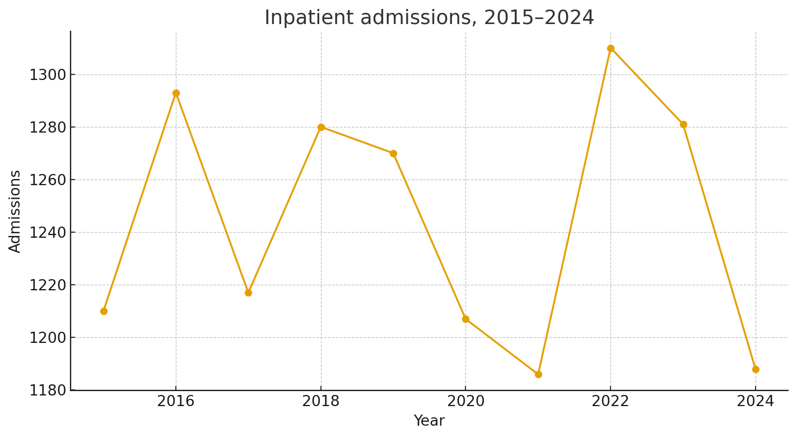
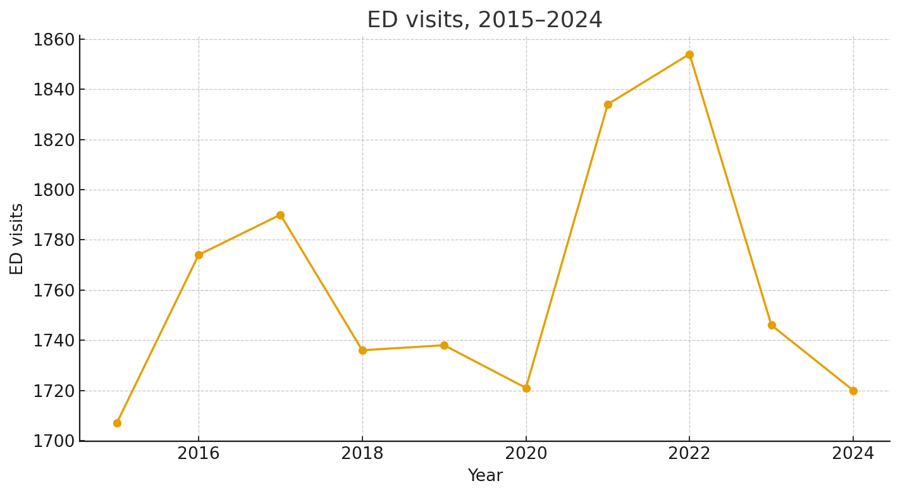
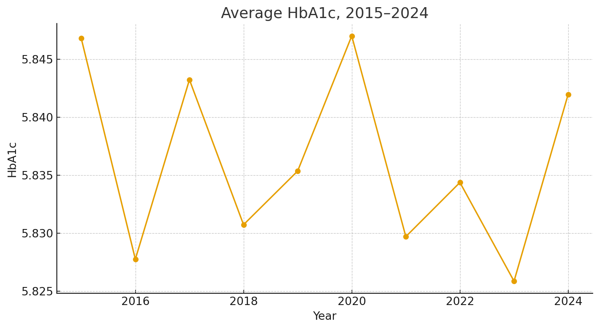
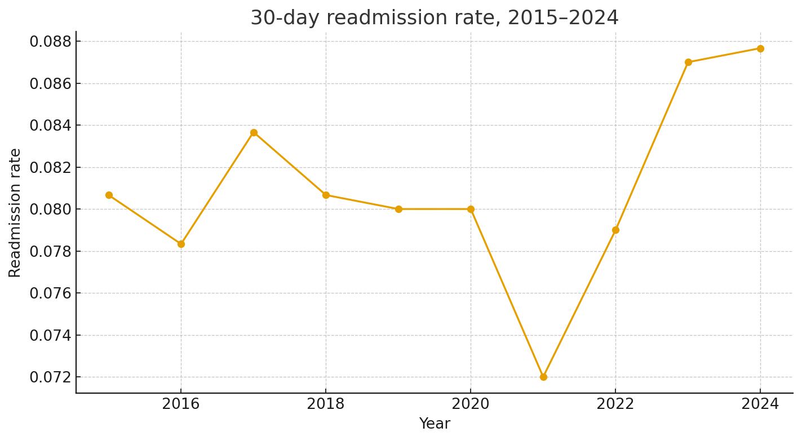
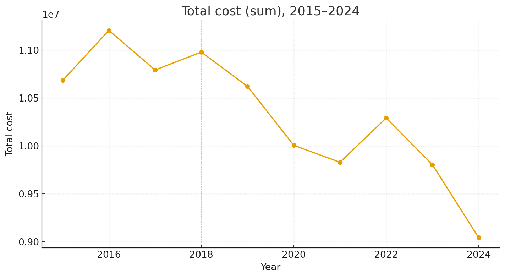
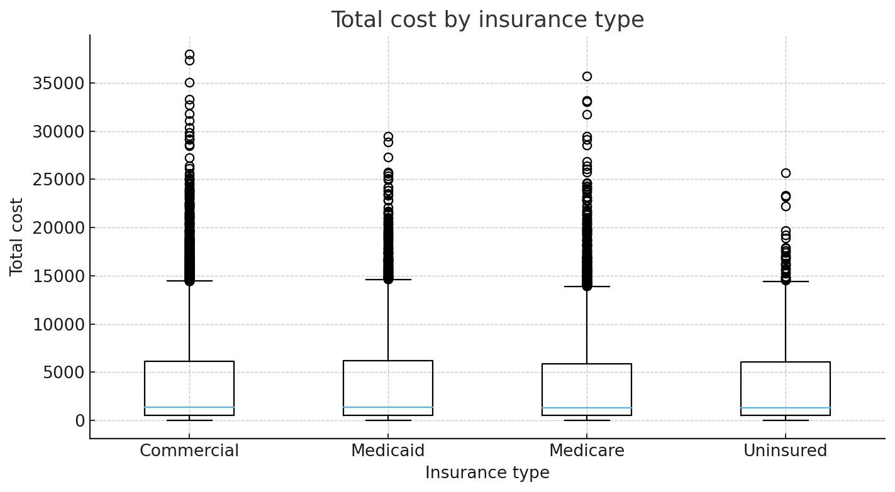
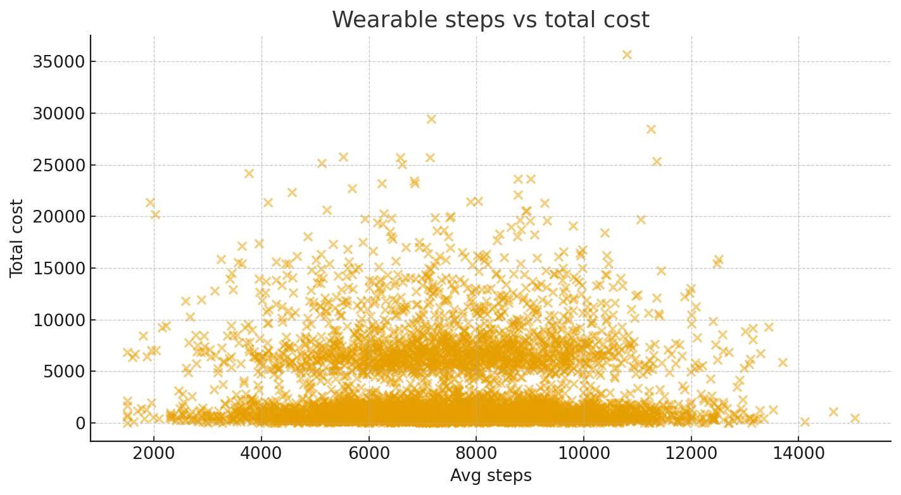
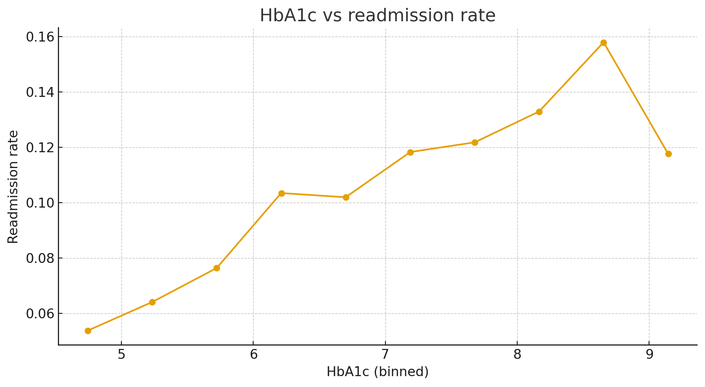

# Healthcare Analytics Portfolio (Anonymized)

**Data Analyst** specializing in end-to-end analytics, survey & operational insights, and reproducible reporting.
This portfolio demonstrates a 10-year (2015–2024) chronic-care dataset with descriptive analytics, correlations,
**logistic regression for readmissions**, **OLS for total cost**, **ANOVA**, and reproducible charts via GitHub Actions.

  <a class="port-btn" href="{{ site.github.repository_url }}">View on GitHub</a>
  <a class="port-btn" href="#projects">Explore My Projects</a>
  <a class="port-btn" href="{{ '/resume.pdf' | relative_url }}">Download Résumé</a>
  <a class="port-btn" href="https://www.linkedin.com/in/derrick-dzormeku-mba-75288644" target="_blank" rel="noopener">LinkedIn</a>

---

## Professional Summary
> Strategic and customer-centered Data Analyst with over 5 years of experience leading data-driven initiatives. Proficient in Python, SPSS, R, Power BI and Tableau, with a proven record of developing scalable insights that enhance user engagement, satisfaction, and program effectiveness. Experienced in sentiment analysis, survey management, and cross-functional collaboration to drive business impact. Passionate about crafting data solutions that improve experiences and reduce churn.

**Keywords:** data analytics, Python, SPSS, R, Tableau, Power BI, predictive modeling, survey analytics, reporting automation, GitHub Actions, reproducible workflows

---

## Why this Portfolio?
I turn complex, real-world data into **clear actionable insight for decision making**. Each project shows a reproducible pipeline:
**Raw Data → Cleaning → Analysis/Models → Visualization → Insight → Action.**

---

## Featured visuals

- Admissions trend — *utilization over time*  
  

- ED visits trend — *front-door demand*  
  

- Average HbA1c — *clinical control signal*  
  

- Readmission rate (30d) — *outcome metric*  
  

- Total cost — *budget signal*  
  

- Cost by insurance — *variation*  
  

- Steps vs cost — *behavior vs spend*  
  

- HbA1c vs readmission — *clinical driver*  
  

---

## Dataset
- File: [`healthcare_2015_2024_patient_year.csv`](./healthcare_2015_2024_patient_year.csv)  
- Unit: patient-year records with demographics, conditions, utilization, outcomes, cost, and program flags.

---

## Statistical analysis
- **Descriptive statistics (table):** [desc_stats.md](desc_stats.md)
- **Correlation matrix:** [corr_matrix.md](corr_matrix.md)
- **Logistic regression:** (readmit): [summary + interpretation](regression_logit_readmission.md)
- **OLS (total cost):** [summary + interpretation](regression_ols_total_cost.md)
- **ANOVA (year):** [anova_total_cost_by_year.md](anova_total_cost_by_year.md)
- **t-test (HbA1c):** [ttest_hba1c_care_mgmt_diabetes.md](ttest_hba1c_care_mgmt_diabetes.md)

---

## Case studies & trends
See **[case studies & future trends](./case_studies.html)** for a concise briefing on analytics types, operational wins,
AI adoption, and implementation challenges in healthcare analytics.
